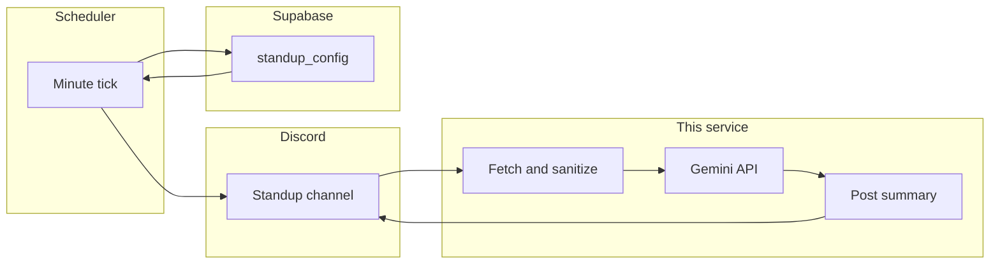

# Daily Standup Summarizer (Discord)

A Node.js Discord bot that collects async daily standup messages from a channel, summarizes them with Google Gemini, and posts a structured end-of-day summary back to your server. Per-guild settings (channel, timezone, schedule, reporter role, active weekdays) live in Supabase and are managed through an interactive `/standup-config` hub.

## Features

- **Scheduled workflow** — Daily reminder, missing-reporter nudge, and summary at times you configure (per guild, per timezone)
- **AI summaries** — Gemini turns raw check-ins into sections: Key Accomplishments, Active Focus Areas, Blockers & Dependencies (with Discord mentions preserved)
- **Noise filtering** — Ignores bots, system messages, emoji-only posts, and invalid check-ins; attachment-only posts count as valid
- **Multi-server** — One deployment serves every guild you invite; each server configures itself independently
- **Manual controls** — Force summarize, remind missing reporters, or debug the reminder message via slash commands
- **Markdown export** — Summary messages include a download button for a `.md` file with display names

## How it works



1. Team members post async DSMs in the configured channel.
2. An in-process scheduler runs every minute (`STANDUP_INTERNAL_SCHEDULER`, default on) and matches each enabled guild’s reminder, nudge, and summary times (active weekdays only, default Mon–Fri).
3. At summary time, the bot ingests messages for the current calendar day in the guild timezone, calls Gemini, and posts a Components V2 summary with optional markdown download.

Optional: trigger the same tick via `POST /cron/standup` with `Authorization: Bearer <CRON_SECRET>`.

## Requirements

- **Node.js** 20+
- **Discord** application with bot token, interactions endpoint, **Message Content Intent**, and **Server Members Intent** (for role-based reminders and missing-reporter nudges)
- **Supabase** project (guild configuration)
- **Google Gemini** API key

## Quick start (local)

```bash
git clone https://github.com/YOUR_ORG/wizard-of-oz-discord.git
cd wizard-of-oz-discord
cp .env.example .env
# Fill in .env — see docs/env-setup.md for where to get each value
npm install
npm run dev
```

Verify the server:

```bash
curl http://localhost:3000/health
```

For slash commands locally, expose port 3000 (e.g. ngrok) and set **Interactions Endpoint URL** in the Discord Developer Portal to `https://<your-tunnel>/discord/interactions`.

### Supabase migrations

Run these in order in the Supabase SQL editor before using schedule or role features:

1. `supabase/migrations/001_standup_config.sql`
2. `supabase/migrations/002_standup_schedule.sql`
3. `supabase/migrations/003_standup_reporter_role.sql`
4. `supabase/migrations/004_standup_active_weekdays.sql`

### Configure in Discord

1. Invite the bot with scopes **`bot`** and **`applications.commands`** (View Channel, Read Message History, Send Messages, Embed Links).
2. Run **`/standup-config`** (requires **Manage Server**) and set channel, timezone, schedule, active days, and optional reporter role.
3. Post standups in that channel; summaries run on your configured schedule.

## Slash commands

| Command | Description |
| --- | --- |
| `/standup-config` | Interactive hub: channel, timezone, schedule, active weekdays, reporter role, enable/disable |
| `/standup summarize` | Force-run the summary pipeline (optional `month`, `day`, `year` in guild timezone) |
| `/standup remind-missing` | Mention reporters who have not posted a valid check-in today (guild timezone) |
| `/standup start` | Force-post the daily DSM reminder (does not update `last_reminder_date`) |

## Environment variables

Copy [`.env.example`](.env.example) to `.env`. Full setup instructions: **[docs/env-setup.md](docs/env-setup.md)**.

| Variable | Purpose |
| --- | --- |
| `DISCORD_BOT_TOKEN` | Bot API access |
| `DISCORD_APPLICATION_ID` | Slash commands and interactions |
| `DISCORD_PUBLIC_KEY` | Interaction signature verification |
| `SUPABASE_URL` | Supabase project URL |
| `SUPABASE_SECRET_KEY` | Server-only secret key (`sb_secret_...`) |
| `GEMINI_API_KEY` | Gemini summarization |
| `CRON_SECRET` | Bearer token for `POST /cron/standup` |
| `STANDUP_INTERNAL_SCHEDULER` | In-process scheduler (default `true`) |
| `GEMINI_MODEL` | Model id (default `gemini-3.1-flash-lite`) |
| `PORT` | HTTP port (default `3000`) |

Channel, timezone, and schedule are **not** in `.env` — they are stored per guild in Supabase via `/standup-config`.

## Deploy (Render)

[`render.yaml`](render.yaml) defines a web service. After deploy:

1. Set secret env vars in the Render dashboard.
2. Run Supabase migrations.
3. Discord Developer Portal → **Interactions Endpoint URL**: `https://<your-service>.onrender.com/discord/interactions`
4. In each server: `/standup-config` → enable and configure.
5. **Free tier:** configure external keep-alive so the in-process scheduler stays running — see [docs/env-setup.md — Render free tier: keep scheduler alive](docs/env-setup.md#render-free-tier-keep-scheduler-alive).

Health check: `GET /health`.

## Scripts

| Command | Description |
| --- | --- |
| `npm run dev` | Development with hot reload (`tsx watch`) |
| `npm run build` | Compile TypeScript to `dist/` |
| `npm start` | Run production build |

## Project layout

| Path | Role |
| --- | --- |
| `src/index.ts` | HTTP server: health, cron, Discord interactions |
| `src/cron/` | Internal scheduler and standup tick |
| `src/pipeline.ts` | Ingest → Gemini → broadcast orchestration |
| `src/commands/` | Slash commands and config UI |
| `src/ingestion/` | Discord message fetch and sanitization |
| `src/processing/` | Gemini client and prompts |
| `src/egress/` | Summary posting (Components V2) |
| `src/storage/` | Supabase config store |
| `docs/` | Specification and env setup guides |

## Documentation

- **[docs/setup.md](docs/setup.md)** — Product specification, edge cases, and behavior details
- **[docs/env-setup.md](docs/env-setup.md)** — Step-by-step credentials and Discord portal checklist
- **[.agents/AGENTS.md](.agents/AGENTS.md)** — Architecture notes for contributors and agents

## License

Private project (`package.json` → `"private": true`). Add a license file if you intend to open-source it.
